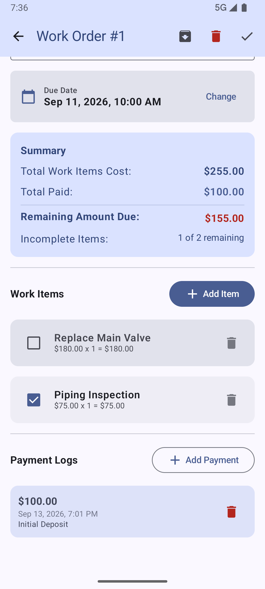
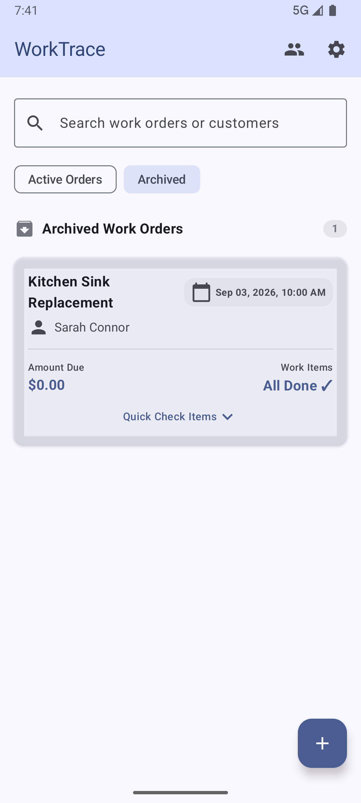
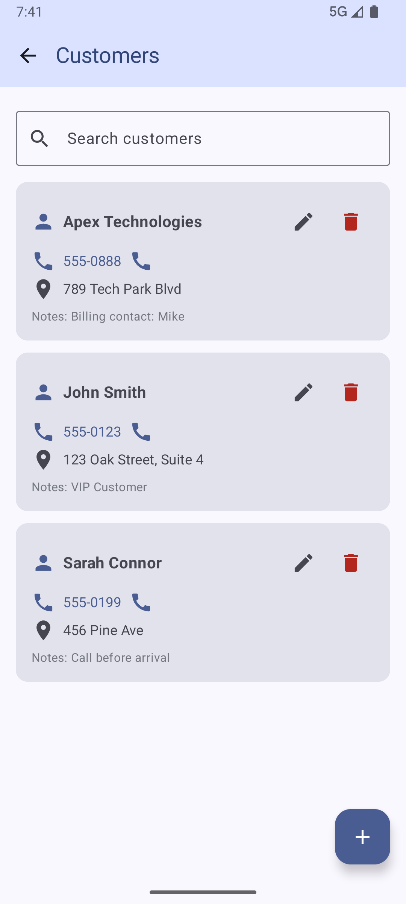

# WorkTrace 📋⚡

**WorkTrace** is a modern, intuitive Android application designed for contractors, technicians, and service providers to track work orders, manage client information, calculate job costs, log payments, and stay on top of overdue tasks.

---

## 🌟 Key Features

- **Smart Overdue & Date Categorization**: Automatically categorizes active work orders into **Overdue Work** (scheduled yesterday or earlier), **Today's Work**, **Tomorrow's Work**, and **Upcoming & Later Work**. The Overdue section dynamically displays pending work and hides automatically when there is no overdue work.
- **Manual Work Order Archiving**: Easily archive completed or past work orders to keep your active list clean and organized, while keeping access to archived orders under a separate **Archived** tab.
- **Quick-Check Items**: Expand work items directly on the main list to quickly check off completed tasks without leaving the main screen.
- **Automatic Cost & Payment Ledger**: Add work items (with price and quantity) and log payments. WorkTrace automatically calculates total job costs, total paid, and remaining balance due.
- **Customer Directory**: Manage client profiles with contact numbers, physical addresses, and specific notes.
- **Daily Reminders**: Integrated WorkManager daily notifications to alert you about upcoming tasks and due dates.

---

## 📸 Screenshots

| Active Work Orders & Overdue List | Work Order Details & Payment Ledger |
| :---: | :---: |
|  |  |

| Archived Work Orders View | Customer Directory |
| :---: | :---: |
|  |  |

---

## 🏗️ Tech Stack & Architecture

- **Language**: 100% Kotlin
- **UI Framework**: Jetpack Compose with Material 3 design system
- **Architecture**: MVVM (Model-View-ViewModel) + Repository Pattern
- **Asynchronous Flow**: Kotlin Coroutines & StateFlow
- **Local Persistence**: Room Database (with KSP code generation)
- **Background Tasks**: AndroidX WorkManager
- **Unit Testing**: JUnit 4 with `kotlinx-coroutines-test`

---

## 🚀 Getting Started

### Prerequisites
- Android Studio Ladybug (or newer) / JDK 17
- Android SDK 35 (minSdk 24)

### Building & Running

1. **Clone the repository**:
   ```bash
   git clone git@github.com:Elkfrawy/WorkTrace.git
   cd WorkTrace
   ```

2. **Build the Debug APK**:
   ```bash
   ./gradlew assembleDebug
   ```

3. **Run Unit Tests**:
   ```bash
   ./gradlew test
   ```

4. **Deploy to connected device or emulator**:
   ```bash
   ./gradlew installDebug
   ```

---

## 📄 License

Distributed under the MIT License. See `LICENSE` for details.
